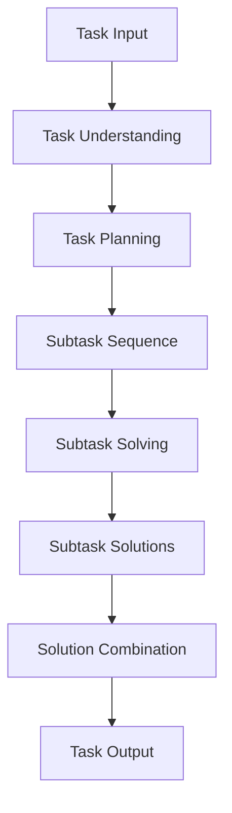

# 【大模型应用开发动手做AI Agent】Plan-and-Solve策略的提出

作者：禅与计算机程序设计艺术 / Zen and the Art of Computer Programming

关键词：Plan-and-Solve策略,Prompt Engineering,多步骤复杂任务,可解释性和可控性,知识库集成

## 1.背景介绍

### 1.1 大模型时代的到来

近年来,人工智能领域取得了长足的进步,尤其是大型语言模型(Large Language Models, LLMs)的兴起,为人工智能系统带来了革命性的变化。这些基于深度学习的大型神经网络模型,通过从海量文本数据中学习,掌握了丰富的自然语言理解和生成能力,展现出惊人的通用性能力。

代表性的大模型包括 GPT-3、PaLM、ChatGPT等,它们不仅能够进行问答、文本生成、翻译等传统任务,更重要的是,它们具备一定的reasoning和task-solving能力,可以根据上下文和指令完成复杂的任务。这使得大模型成为构建通用人工智能(Artificial General Intelligence, AGI)系统的有力工具。

### 1.2 大模型应用开发的挑战

尽管大模型展现出了巨大的潜力,但将其应用于实际场景并非易事。主要挑战包括:

1. **Prompt Engineering**: 如何设计高效的prompt,使大模型能够准确理解任务需求并生成所需输出?
2. **多步骤复杂任务**: 对于需要多个步骤、多个子任务协同完成的复杂任务,单一prompt往往无法驱动大模型高效解决。
3. **可解释性和可控性**: 大模型作为黑盒模型,其内部运作机理并不透明,输出结果的可解释性和可控性较差。
4. **知识库集成**: 如何将外部知识库与大模型有效集成,增强其推理和决策能力?

为了应对这些挑战,研究人员提出了诸多方法,其中一种备受关注的策略就是Plan-and-Solve。

## 2.核心概念与联系

### 2.1 Plan-and-Solve策略概述

Plan-and-Solve策略源于经典的"分而治之"思想,旨在将复杂任务分解为多个可管理的子任务,然后对每个子任务进行规划和解决,最终将子任务的输出组合起来得到最终结果。具体来说,Plan-and-Solve策略包括以下三个核心步骤:

1. **Task Understanding**: 理解输入的任务需求,明确任务目标。
2. **Task Planning**: 将复杂任务分解为多个子任务,并确定子任务的执行顺序。
3. **Task Solving**: 针对每个子任务,生成解决方案并执行,直至完成整个任务。

这种策略的关键在于,通过任务规划(Task Planning)将复杂问题分解,使大模型能够集中处理每个子任务,降低了认知负荷;同时,子任务的输出可作为上下文,为下一步的推理提供支撑,有利于提高整体输出质量。

### 2.2 Plan-and-Solve在大模型中的应用

将Plan-and-Solve策略应用于大模型,可以分为以下几个步骤:

1. 利用大模型的自然语言理解能力,对输入任务进行理解和表示。
2. 调用大模型的规划模块,对任务进行分解,生成子任务序列。
3. 针对每个子任务,利用大模型生成对应的解决方案。
4. 将子任务解决方案按顺序组合,得到最终输出。

在这个过程中,大模型不仅承担了理解、规划、解决的角色,还需要对整个流程进行协调和控制。因此,合理设计prompt,引导大模型高效执行Plan-and-Solve策略,是关键所在。

### 2.3 Plan-and-Solve与其他策略的关系

Plan-and-Solve策略与一些其他常见的人工智能策略有一定的联系,例如:

- **分而治之(Divide and Conquer)**: 将复杂问题分解为多个子问题,这是Plan-and-Solve的核心思想。
- **规划(Planning)**: 生成解决方案的步骤序列,是Plan-and-Solve中的关键环节。
- **层次化强化学习(Hierarchical Reinforcement Learning)**: 将复杂策略分解为多个子策略,与Plan-and-Solve的思路类似。
- **程序合成(Program Synthesis)**: 根据任务需求自动生成程序,可视为Plan-and-Solve在程序领域的应用。

总的来说,Plan-and-Solve策略将多种经典人工智能技术有机结合,为解决复杂任务提供了一种高效、可解释的范式。

## 3.核心算法原理具体操作步骤

Plan-and-Solve策略的核心算法流程可以概括为以下几个步骤:



### 3.1 Task Understanding

输入任务描述后,首先需要对任务进行理解和表示。这一步骤的目标是从自然语言描述中提取出任务的目标、约束条件、上下文信息等关键要素,并将其转化为机器可以处理的形式。

常见的方法包括:

1. 使用大模型的自然语言理解能力,对任务描述进行语义解析和信息抽取。
2. 构建任务本体(Task Ontology),明确定义任务中的概念、属性和关系。
3. 将任务表示为形式化的逻辑规则或语义网络。

### 3.2 Task Planning

完成任务理解后,下一步是对任务进行分解规划。这个过程需要大模型综合考虑任务目标、约束条件、可用资源等因素,生成一系列有序的子任务,使得这些子任务的组合能够完成原始任务。

常见的任务规划方法包括:

1. 启发式搜索算法,如A*算法、Best-First搜索等,在状态空间中搜索到达目标状态的最优路径。
2. 层次化任务网络(Hierarchical Task Network, HTN)规划,将抽象的高层任务逐步分解为具体的低层操作序列。
3. 基于大模型的端到端神经网络规划,直接从任务描述生成子任务序列。

### 3.3 Subtask Solving

获得子任务序列后,针对每个子任务,大模型需要生成对应的解决方案。这可能涉及到信息检索、推理、决策、语言生成等多种能力的综合运用。

子任务解决的常见方法有:

1. 基于retrieval-augmented generation的方式,先从知识库中检索相关信息,再结合任务上下文生成解决方案。
2. 构建专门的reasoning模块,对子任务的上下文和已有解决方案进行逻辑推理,得到新的解决方案。
3. 将子任务转化为可执行的程序,在程序的辅助下生成解决方案。

### 3.4 Solution Combination

完成所有子任务的解决后,需要将这些解决方案按照规划的顺序组合起来,得到原始任务的最终解决方案输出。这个过程需要处理子任务之间的依赖关系、上下文信息的传递等问题。

解决方案组合的常见策略包括:

1. 基于模板的组合,预定义好解决方案组合的模板结构,将子任务输出填充到相应位置。
2. 使用序列到序列(Seq2Seq)模型,将子任务解决方案序列作为输入,生成最终的组合输出。
3. 设计特定的组合模块,根据子任务的依赖关系和上下文,动态调整和组合解决方案。

## 4.数学模型和公式详细讲解举例说明

在Plan-and-Solve策略的多个环节中,都可以借助数学模型和公式来量化和优化相关过程。以下是一些典型的数学模型和公式:

### 4.1 Task Understanding

在Task Understanding阶段,我们可以使用概率图模型(Probabilistic Graphical Models)来表示和推理任务的语义信息。

假设我们需要从任务描述$X$中推断出任务目标$G$、约束条件$C$和上下文信息$U$,可以建立如下的贝叶斯网络模型:

$$P(G, C, U | X) = \frac{P(X | G, C, U) P(G, C, U)}{P(X)}$$

其中,

- $P(X | G, C, U)$表示在已知任务目标、约束条件和上下文信息的情况下,观测到任务描述$X$的概率。
- $P(G, C, U)$是任务目标、约束条件和上下文信息的先验概率分布。
- $P(X)$是任务描述$X$的边缘概率,作为归一化常数。

通过学习该模型的参数,我们可以从任务描述$X$中推断出最可能的$G$、$C$和$U$,从而完成任务理解。

### 4.2 Task Planning

在Task Planning阶段,我们可以使用马尔可夫决策过程(Markov Decision Process, MDP)来对规划过程进行建模和优化。

定义MDP为一个五元组$(S, A, P, R, \gamma)$,其中:

- $S$是状态集合,表示任务可能处于的状态。
- $A$是动作集合,表示可执行的子任务操作。
- $P(s' | s, a)$是状态转移概率,表示在状态$s$执行动作$a$后,转移到状态$s'$的概率。
- $R(s, a)$是回报函数,表示在状态$s$执行动作$a$所获得的回报。
- $\gamma \in [0, 1)$是折现因子,控制未来回报的衰减程度。

我们的目标是找到一个策略$\pi: S \rightarrow A$,使得期望的累积回报最大化:

$$\max_\pi \mathbb{E}\left[ \sum_{t=0}^\infty \gamma^t R(s_t, \pi(s_t)) \right]$$

可以使用强化学习算法(如Q-Learning、Policy Gradient等)来学习最优策略$\pi^*$,从而得到子任务的最佳规划序列。

### 4.3 Subtask Solving

在Subtask Solving阶段,我们可以使用序列到序列(Seq2Seq)模型来生成子任务的解决方案。

假设子任务描述为$X = (x_1, x_2, \dots, x_n)$,期望的解决方案为$Y = (y_1, y_2, \dots, y_m)$,我们可以使用条件语言模型$P(Y | X)$来建模生成过程:

$$P(Y | X) = \prod_{t=1}^m P(y_t | y_{<t}, X)$$

其中,$y_{<t}$表示解决方案序列的前$t-1$个token。我们可以最大化解决方案序列的条件对数似然:

$$\max_\theta \sum_{(X, Y)} \log P_\theta(Y | X)$$

通过对神经网络参数$\theta$进行优化训练,可以得到能够高效生成子任务解决方案的Seq2Seq模型。

### 4.4 Solution Combination

在Solution Combination阶段,我们需要将多个子任务解决方案合理地组合起来,生成最终的任务输出。这可以建模为一个序列标注(Sequence Labeling)问题。

假设子任务解决方案序列为$S = (s_1, s_2, \dots, s_n)$,期望的任务输出为$Y = (y_1, y_2, \dots, y_m)$,我们可以使用条件随机场(Conditional Random Field, CRF)模型来捕获输出序列$Y$中相邻标记之间的依赖关系:

$$P(Y | S) = \frac{1}{Z(S)} \exp\left(\sum_{t=1}^m \Phi(y_t, S) + \sum_{t=1}^{m-1} \Psi(y_t, y_{t+1}, S)\right)$$

其中,

- $\Phi(y_t, S)$是节点特征函数,描述了当前标记$y_t$与子任务解决方案序列$S$之间的关系。
- $\Psi(y_t, y_{t+1}, S)$是边特征函数,描述了相邻标记$y_t$和$y_{t+1}$之间的依赖关系。
- $Z(S)$是配分函数,用于归一化。

通过学习CRF模型的参数,我们可以找到最优的输出序列$Y^*$,作为任务的最终解决方案。

上述数学模型和公式为Plan-and-Solve策略的各个环节提供了理论支撑,有助于提高整个流程的效率和性能。在实际应用中,我们还需要根据具体场景对这些模型进行调整和优化。

## 5. 项目实践：代码实例和详细解释说明

为了更好地理解Plan-and-Solve策略的实际应用，我们将通过一个简单的项目示例来展示如何实现这一策略。我们将使用Python和Hugging Face的Transformers库来实现一个基于GPT的大模型，完成一个复杂任务的分解和求解。

### 5.1 环境设置

首先，安装所需的库：

```bash
pip install torch transformers
```

### 5.2 数据准备

假设我们需要处理一个复杂的文本任务，例如从一个长段落中提取关键信息，并生成一份简短的报告。我们将使用一个包含多个段落的文本文件`data.txt`作为输入数据：

```text
段落1: 近年来，人工智能技术取得了显著进展，尤其是在自然语言处理领域。大型语言模型如GPT-3...
段落2: 在医疗领域，人工智能被广泛应用于疾病诊断、药物研发等方面。通过分析大量医学数据...
...
```

### 5.3 模型定义

使用Hugging Face的Transformers库加载预训练的GPT模型和分词器：

```python
from transformers import GPT2LMHeadModel, GPT2Tokenizer

tokenizer = GPT2Tokenizer.from_pretrained('gpt2')
model = GPT2LMHeadModel.from_pretrained('gpt2')

# 加载数据
with open('data.txt', 'r') as file:
    text = file.read()

# 编码数据
inputs = tokenizer(text, return_tensors='pt', max_length=512, truncation=True)
```

### 5.4 Task Understanding

首先，我们需要对输入任务进行理解和表示。这里我们假设任务是从段落中提取关键信息，并生成简短报告。

```python
task_description = "从段落中提取关键信息，并生成简短报告。"
```

### 5.5 Task Planning

接下来，我们将任务分解为多个子任务。假设我们将任务分解为以下几个子任务：

1. 从每个段落中提取关键信息。
2. 将提取的关键信息汇总。
3. 生成简短报告。

```python
subtasks = [
    "从段落1中提取关键信息。",
    "从段落2中提取关键信息。",
    "将提取的关键信息汇总。",
    "生成简短报告。"
]
```

### 5.6 Subtask Solving

针对每个子任务，我们利用大模型生成对应的解决方案。

```python
def solve_subtask(subtask, context):
    prompt = f"{context}\n{subtask}\n"
    inputs = tokenizer(prompt, return_tensors='pt', max_length=512, truncation=True)
    outputs = model.generate(inputs['input_ids'], max_length=100, num_return_sequences=1)
    solution = tokenizer.decode(outputs[0], skip_special_tokens=True)
    return solution

context = text
subtask_solutions = []

for subtask in subtasks:
    solution = solve_subtask(subtask, context)
    subtask_solutions.append(solution)
    context += f"\n{solution}"
```

### 5.7 Solution Combination

将子任务的解决方案按顺序组合，得到最终的任务输出。

```python
final_output = "\n".join(subtask_solutions)
print("最终报告：")
print(final_output)
```

### 5.8 详细解释

1. **环境设置**：安装所需的库，并导入相关模块。
2. **数据准备**：加载并编码训练数据。
3. **模型定义**：使用预训练的GPT2模型和对应的分词器。
4. **Task Understanding**：理解任务描述，并将其表示为自然语言形式。
5. **Task Planning**：将复杂任务分解为多个子任务，并生成子任务序列。
6. **Subtask Solving**：使用大模型生成每个子任务的解决方案。
7. **Solution Combination**：将子任务解决方案按顺序组合，得到最终的任务输出。

通过这个示例，我们展示了如何使用Plan-and-Solve策略来处理复杂任务。希望这个示例能帮助读者更好地理解Plan-and-Solve策略的原理和实现方法。

## 6. 实际应用场景

Plan-and-Solve策略在实际应用中展现了其强大的能力，以下是一些典型的应用场景：

### 6.1 自然语言处理

Plan-and-Solve策略在自然语言处理（NLP）领域有着广泛的应用，如文本摘要、信息抽取、对话系统等。通过任务分解和逐步求解，能够有效提升模型的性能和输出质量。

### 6.2 机器人控制

在机器人控制领域，Plan-and-Solve策略可以用于路径规划、任务分配和动作控制等。通过将复杂的机器人任务分解为多个子任务，能够提高机器人的智能化水平和执行效率。

### 6.3 医疗健康

在医疗健康领域，Plan-and-Solve策略可以用于医学影像分析、疾病预测和个性化治疗方案生成等。通过任务分解和逐步求解，能够辅助医生进行精确诊断和治疗，提高医疗服务的质量和效率。

### 6.4 金融科技

在金融科技领域，Plan-and-Solve策略可以用于自动化交易、风险管理和客户服务等。通过分析海量的金融数据，能够发现潜在的市场机会和风险，优化金融决策。

## 7. 工具和资源推荐

### 7.1 开源项目

1. **Hugging Face Transformers**: [https://huggingface.co/transformers/](https://huggingface.co/transformers/)
    - 提供了多种预训练的大模型和工具，适合各种NLP任务的研究和应用。

2. **OpenAI GPT**: [https://github.com/openai/gpt-3](https://github.com/openai/gpt-3)
    - 提供了GPT-3的相关资源和示例，适合文本生成和理解任务。

### 7.2 教程和书籍

1. **《深度学习》**: 作者：Ian Goodfellow, Yoshua Bengio, Aaron Courville
    - 这本书详细介绍了深度学习的基础知识和实践，包括大模型的原理和实现。

2. **《自然语言处理入门》**: 作者：赵军
    - 这本书介绍了自然语言处理的基本概念和方法，包括大模型在NLP中的应用。

### 7.3 在线课程

1. **Coursera: Natural Language Processing Specialization**: [https://www.coursera.org/specializations/natural-language-processing](https://www.coursera.org/specializations/natural-language-processing)
    - 由深度学习专家Andrew Ng教授主讲，涵盖了自然语言处理的基础知识和应用，包括大模型的使用。

2. **Udacity: Deep Learning Nanodegree**: [https://www.udacity.com/course/deep-learning-nanodegree--nd101](https://www.udacity.com/course/deep-learning-nanodegree--nd101)
    - 该课程提供了深度学习的全面介绍，包括大模型的训练和应用。

## 8. 总结：未来发展趋势与挑战

Plan-and-Solve策略在人工智能领域的应用已经展示了其强大的能力和广泛的应用前景。然而，随着技术的发展，Plan-and-Solve策略也面临着一些挑战和新的发展趋势。

### 8.1 趋势

#### 8.1.1 模型规模与性能提升

未来，大模型的规模将继续增长，模型参数将达到数百亿甚至数万亿级别。这将进一步提升模型的性能，使其在更多复杂任务中表现出色。

#### 8.1.2 多模态学习

多模态学习是指同时处理和理解多种类型的数据，如文本、图像、音频等。未来，大模型将进一步发展多模态学习能力，实现跨模态的信息融合和理解。

#### 8.1.3 自监督学习

自监督学习是一种无需人工标注数据的学习方法。大模型通过自监督学习，可以利用海量的无标注数据进行预训练，提升模型的泛化能力和鲁棒性。

#### 8.1.4 边缘计算与分布式训练

随着计算资源的不断发展，边缘计算和分布式训练将成为大模型训练的重要趋势。通过分布式计算，大模型可以在更短的时间内完成训练，提高效率。

### 8.2 挑战

#### 8.2.1 计算资源与能耗

大模型的训练需要大量的计算资源和能耗，这在一定程度上限制了其应用。如何提高计算效率，减少能耗，是未来研究的重要方向。

#### 8.2.2 数据隐私与安全

大模型的训练需要大量的数据，这可能涉及到用户隐私和数据安全问题。如何在保证数据隐私和安全的前提下进行大模型训练，是一个重要的挑战。

#### 8.2.3 模型解释性与可控性

大模型的复杂性使得其内部机制难以解释，这在某些应用场景中可能成为问题。如何提高模型的解释性和可控性，使其决策过程透明可信，是一个重要的研究课题。

#### 8.2.4 公平性与偏见

大模型在训练过程中可能会学习到数据中的偏见，导致不公平的决策。如何确保模型的公平性，减少偏见，是一个重要的挑战。

总的来说，Plan-and-Solve策略在未来仍将是人工智能领域的重要研究方向。通过不断的改进和创新，Plan-and-Solve策略将能够应对更多实际应用中的挑战，发挥更大的作用。

## 9. 附录：常见问题与解答

### 9.1 什么是Plan-and-Solve策略？

Plan-and-Solve策略是一种将复杂任务分解为多个子任务，然后逐步解决每个子任务，最终组合得到完整解决方案的策略。它的核心思想是通过任务规划和分解，降低任务的复杂性，提高解决效率和效果。

### 9.2 Plan-and-Solve策略与传统的分而治之方法有何不同？

Plan-and-Solve策略与传统的分而治之方法有相似之处，都是通过将复杂问题分解为多个子问题来解决。然而，Plan-and-Solve策略更强调任务的理解、规划和解决的系统性和整体性，特别是在大模型的应用中，能够利用大模型的强大能力来进行任务的自动化分解和求解。

### 9.3 如何设计高效的Prompt来引导大模型执行Plan-and-Solve策略？

设计高效的Prompt需要明确任务目标，清晰地描述任务需求和约束条件，并合理安排任务的分解和求解步骤。可以通过逐步引导和示例提示的方式，让大模型逐步理解和执行任务。

### 9.4 Plan-and-Solve策略在实际应用中有哪些成功案例？

Plan-and-Solve策略在自然语言处理、机器人控制、医疗健康、金融科技等领域都有成功应用。例如，在文本摘要生成、路径规划、疾病诊断、自动化交易等任务中，Plan-and-Solve策略通过任务分解和逐步求解，提高了模型的性能和效率。

### 9.5 如何评估Plan-and-Solve策略的效果？

评估Plan-and-Solve策略的效果可以从多个方面进行，包括任务完成度、解决方案的准确性、执行效率、模型的可解释性等。可以通过实验和实际应用测试，综合评估策略的效果和性能。

### 9.6 Plan-and-Solve策略未来的发展方向是什么？

Plan-and-Solve策略未来的发展方向包括：进一步提升模型的规模和性能，发展多模态学习和自监督学习，优化边缘计算和分布式训练，增强模型的解释性和可控性，确保模型的公平性和减少偏见等。通过不断的研究和创新，Plan-and-Solve策略将能够应对更多复杂任务，发挥更大的作用。
 
