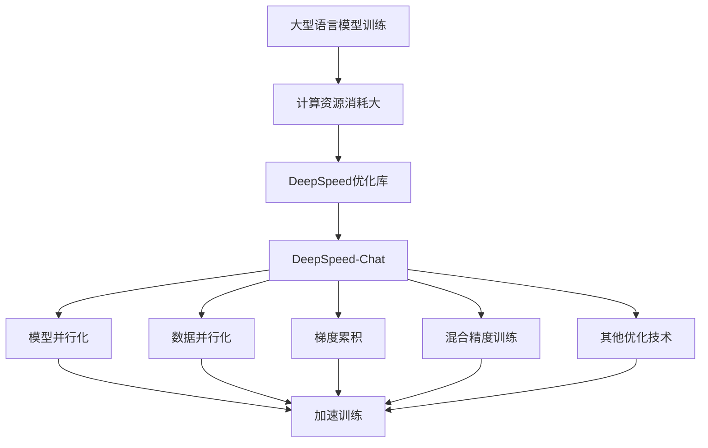
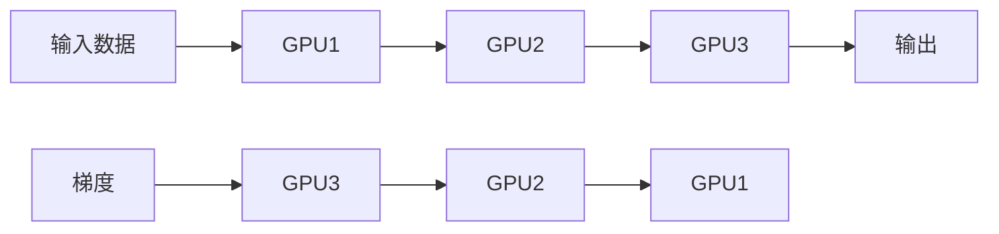
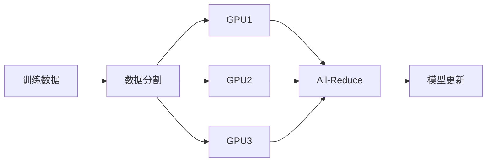
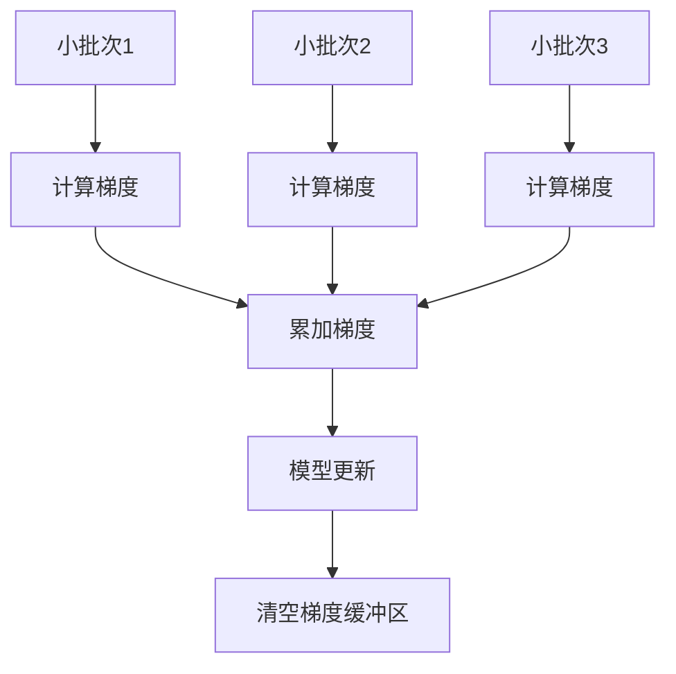
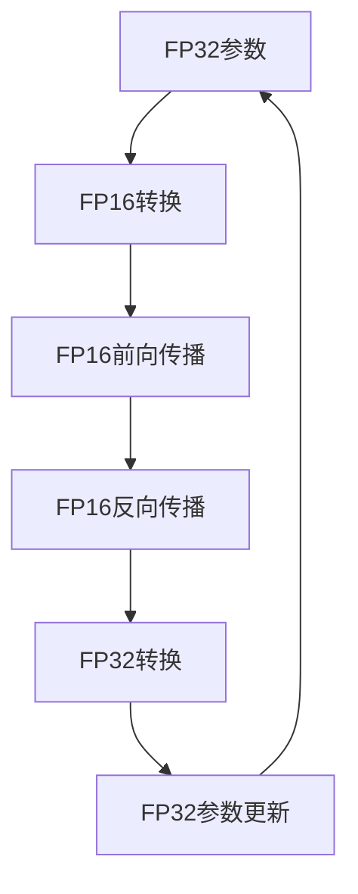
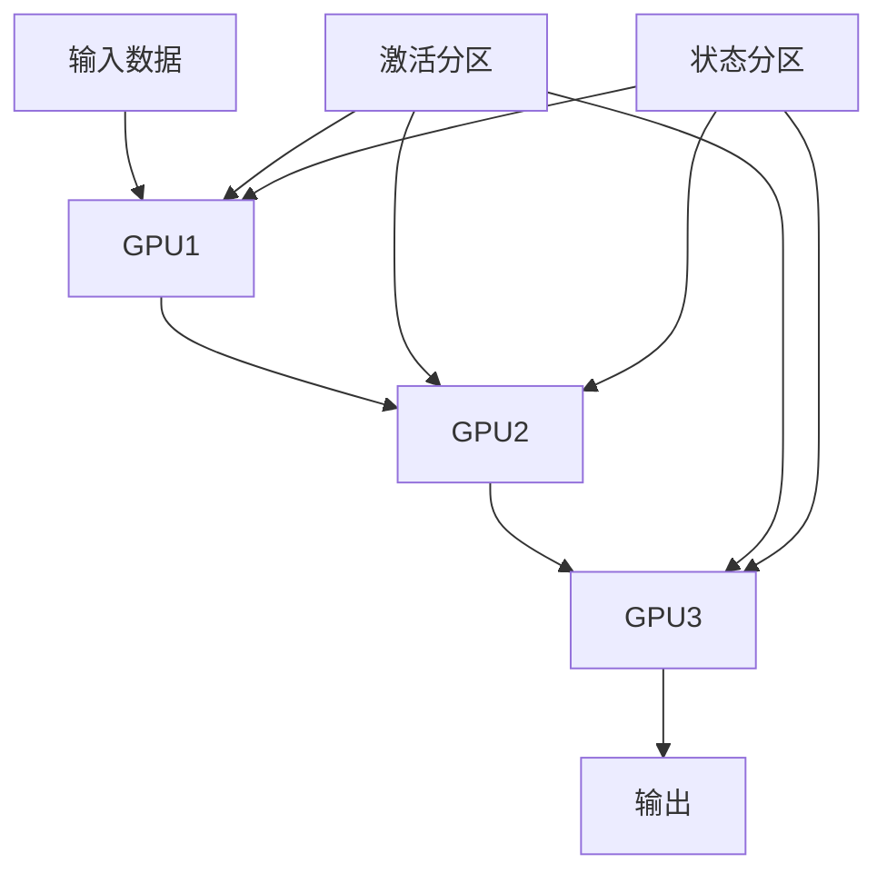
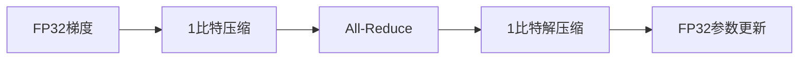

# 大语言模型原理与工程实践：强化学习工程实践 DeepSpeed-Chat 训练调优实践

## 1. 背景介绍

### 1.1 问题的由来

随着人工智能技术的不断发展,大型语言模型已经成为自然语言处理领域的核心驱动力。然而,训练这些庞大的模型需要消耗大量的计算资源,这对于大多数研究机构和公司来说是一个巨大的挑战。为了解决这个问题,微软推出了 DeepSpeed,这是一个用于训练大型模型的优化库。

DeepSpeed 旨在通过各种优化技术来加速训练过程,包括: **模型并行化、数据并行化、梯度累积、混合精度训练**等。

其中,DeepSpeed-Chat 是一个基于强化学习的聊天机器人训练框架,它利用 DeepSpeed 的优化技术来高效地训练大型对话模型。

### 1.2 研究现状

目前,已有一些研究工作探索了 DeepSpeed-Chat 在训练大型对话模型方面的应用。例如,OpenAI 的 GPT-3 模型就采用了 DeepSpeed 进行训练优化。另外,一些学术机构也在使用 DeepSpeed-Chat 来训练开源的对话模型,如 DialoGPT 和 Meena。

然而,由于 DeepSpeed-Chat 涉及了多种优化技术的组合应用,因此对于如何有效地调优和配置这些技术还缺乏系统性的指导。许多研究人员和工程师在实践中仍然面临着诸多挑战,如:如何选择合适的优化策略?如何平衡不同优化技术之间的权衡?如何根据硬件资源和模型大小进行参数调整?等等。

### 1.3 研究意义

本文旨在深入探讨 DeepSpeed-Chat 在训练大型对话模型时的优化技术及其调优实践。通过全面分析 DeepSpeed-Chat 的核心原理、算法细节和数学模型,并结合实际案例和代码示例,我们将为读者提供一个系统性的指导,帮助他们更好地理解和应用这些优化技术。

此外,本文还将分享一些实用的工具和资源推荐,以及对未来发展趋势和挑战的展望,为读者提供更多的实践参考。

### 1.4 本文结构

本文的结构安排如下:

1. 背景介绍
2. 核心概念与联系
3. 核心算法原理与具体操作步骤
4. 数学模型和公式详细讲解与举例说明
5. 项目实践:代码实例和详细解释说明
6. 实际应用场景
7. 工具和资源推荐
8. 总结:未来发展趋势与挑战
9. 附录:常见问题与解答

## 2. 核心概念与联系

在深入探讨 DeepSpeed-Chat 的优化技术之前,我们先来了解一些核心概念及它们之间的联系。



如上图所示,训练大型语言模型需要消耗大量计算资源,这促使了 DeepSpeed 优化库的出现。DeepSpeed 集成了多种优化技术,如模型并行化、数据并行化、梯度累积、混合精度训练等,旨在加速训练过程。而 DeepSpeed-Chat 则是一个专门用于训练大型对话模型的框架,它利用了 DeepSpeed 的这些优化技术。

接下来,我们将逐一介绍这些核心优化技术的原理、算法细节和数学模型,并通过实例讲解它们的具体应用。

## 3. 核心算法原理与具体操作步骤

### 3.1 算法原理概述

DeepSpeed-Chat 包含了多种优化算法,它们的原理和操作步骤有所不同,但都是为了加速大型模型的训练过程。下面是一些主要算法的概述:

1. **模型并行化 (Model Parallelism)**: 将大型模型分割到多个GPU上,每个GPU只需要处理模型的一部分,从而减轻单个GPU的计算压力。

2. **数据并行化 (Data Parallelism)**: 将训练数据分割到多个GPU上,每个GPU处理不同的数据批次,然后汇总梯度进行模型更新。

3. **梯度累积 (Gradient Accumulation)**: 在多个小批次上累积梯度,然后一次性更新模型参数,从而减少通信开销。

4. **混合精度训练 (Mixed Precision Training)**: 利用半精度(FP16)或更低精度进行计算,降低内存占用和计算量,同时保持FP32精度的收敛性能。

5. **ZeRO冗余消除优化 (ZeRO Redundancy Optimizer)**: 通过优化状态和激活的分区策略,消除GPU内存中的冗余数据,支持更大的模型。

6. **1-bit Adam优化 (1-bit Adam Optimizer)**: 通过压缩梯度和权重到1比特,减少通信开销,加速分布式训练。

这些算法可以单独使用,也可以组合使用,形成更加复杂的优化策略。接下来,我们将详细介绍它们的具体操作步骤。

### 3.2 算法步骤详解

#### 3.2.1 模型并行化 (Model Parallelism)

模型并行化的核心思想是将大型模型分割到多个GPU上,每个GPU只需要处理模型的一部分。具体步骤如下:

1. 将模型分割成多个层或块,每个GPU负责处理其中一部分。
2. 在前向传播时,输入数据依次经过各个GPU处理对应的模型部分。
3. 在反向传播时,梯度从最后一个GPU开始逐层反向传播,每个GPU计算并更新自己负责的那部分模型参数。
4. 通过优化通信策略(如环形通信)来减少GPU之间的通信开销。



上图展示了一个3层模型在3个GPU上并行化的示意图。

#### 3.2.2 数据并行化 (Data Parallelism)

数据并行化的核心思想是将训练数据分割到多个GPU上,每个GPU处理不同的数据批次,然后汇总梯度进行模型更新。具体步骤如下:

1. 将训练数据划分成多个批次,分配给不同的GPU。
2. 每个GPU在本地计算前向传播和反向传播,得到本地梯度。
3. 使用All-Reduce操作将所有GPU的本地梯度汇总,得到全局梯度。
4. 每个GPU使用全局梯度更新自己的模型副本。
5. 在下一个训练迭代中,重复上述步骤。



上图展示了数据并行化的基本流程。

#### 3.2.3 梯度累积 (Gradient Accumulation)

梯度累积的核心思想是在多个小批次上累积梯度,然后一次性更新模型参数,从而减少通信开销。具体步骤如下:

1. 将训练数据划分成多个小批次。
2. 对于每个小批次,计算前向传播和反向传播,得到局部梯度。
3. 将局部梯度累加到一个全局梯度缓冲区中。
4. 当累积了指定数量的小批次后,使用累积的全局梯度一次性更新模型参数。
5. 清空全局梯度缓冲区,重复上述步骤进行下一轮累积。



上图展示了梯度累积的基本流程。

#### 3.2.4 混合精度训练 (Mixed Precision Training)

混合精度训练的核心思想是利用半精度(FP16)或更低精度进行计算,降低内存占用和计算量,同时保持FP32精度的收敛性能。具体步骤如下:

1. 将模型参数和梯度存储为FP32精度。
2. 在前向传播和反向传播时,将数据转换为FP16精度进行计算。
3. 使用Loss Scaling技术来避免下溢出问题。
4. 在模型更新时,将FP16梯度转换回FP32,并使用FP32精度进行参数更新。
5. 根据需要,可以使用更低精度(如BF16或FP8)进行部分计算。



上图展示了混合精度训练的基本流程。

#### 3.2.5 ZeRO冗余消除优化 (ZeRO Redundancy Optimizer)

ZeRO冗余消除优化的核心思想是通过优化状态和激活的分区策略,消除GPU内存中的冗余数据,支持更大的模型。具体步骤如下:

1. 将优化器状态(如momentums和velocities)分区到不同的GPU上。
2. 将模型激活(中间层输出)分区到不同的GPU上。
3. 在前向传播时,根据需要在GPU之间传输激活数据。
4. 在反向传播时,根据需要在GPU之间传输梯度和优化器状态。
5. 使用优化的通信策略(如集合通信)来减少GPU之间的通信开销。



上图展示了ZeRO优化中的激活和状态分区策略。

#### 3.2.6 1-bit Adam优化 (1-bit Adam Optimizer)

1-bit Adam优化的核心思想是通过压缩梯度和权重到1比特,减少通信开销,加速分布式训练。具体步骤如下:

1. 在每个GPU上,计算FP32精度的梯度和权重更新。
2. 将FP32梯度和权重压缩为1比特表示。
3. 使用All-Reduce操作在GPU之间传输压缩后的1比特数据。
4. 在每个GPU上,解压缩接收到的1比特数据,恢复FP32精度。
5. 使用解压缩后的FP32梯度和权重更新模型参数。



上图展示了1-bit Adam优化的基本流程。

### 3.3 算法优缺点

每种优化算法都有其优缺点,需要根据具体情况进行权衡选择。

- **模型并行化**:
  - 优点:支持训练超大型模型,突破单GPU内存限制。
  - 缺点:增加了GPU之间的通信开销,并行效率受到模型层数和通信策略的影响。

- **数据并行化**:
  - 优点:实现简单,并行效率较高。
  - 缺点:受限于单GPU内存,无法支持超大型模型。

- **梯度累积**:
  - 优点:减少通信开销,提高计算效率。
  - 缺点:需要更多内存来存储累积的梯度,对小批次训练不太适用。

- **混合精度训练**:
  - 优点:降低内存占用和计算量,提高训练速度。
  - 缺点:需要精细调整Loss Scaling参数,避免数值下溢和溢出。

- **ZeRO冗余消除优化**:
  - 优点:显著减少GPU内存占用,支持更大的模型。
  - 缺点:增加了GPU之间的通信复杂度,需要优化通信策略。

- **1-bit Adam优化**:
  - 优点:大幅减少通信开销,加速分布式训练。
  - 缺点:压缩和解压缩过程引入额外计算开销,可能影响收敛性能。

### 3.4 算法应用领域

这些优化算法在不同的应用领域中都有广泛的应用:

- **自然语言处理**: 包括机器翻译、文本生成、对话系统等。
- **计算机视觉**: 包括图像分类、目标检测、图像生成等。
- **语音识别与合成**: 包括语音识别、语音合成、语音翻译等。
- **推荐系统**: 包括个性化推荐、广告推荐、内容推荐等。
- **强化学习**: 包括游戏AI、机器人控制、自动驾驶等。

## 4. 数学模型和公式详细讲解与举例说明

### 4.1 数学模型构建

在训练大型语言模型时,我们通常需要构建一个数学模型来描述模型的训练过程。这个模型可以用来分析和优化训练过程中的各个环节。下面是一个典型的数学模型:

$$
\min_{\theta} \mathbb{E}_{(x, y) \sim D} [L(f(x; \theta), y)]
$$

其中, $\theta$ 表示模型参数, $D$ 表示训练数据集, $L$ 表示损失函数, $f(x; \theta)$ 表示模型的预测结果。

### 4.2 公式推导过程

在训练过程中,我们需要计算模型的梯度,并使用梯度下降法来更新模型参数。具体的梯度计算和参数更新过程如下:

1. 计算损失函数的梯度:

$$
\nabla_{\theta} L(f(x; \theta), y)
$$

2. 使用梯度下降法更新模型参数:

$$
\theta_{t+1} = \theta_t - \eta \nabla_{\theta} L(f(x; \theta_t), y)
$$

其中, $\eta$ 表示学习率, $t$ 表示训练迭代次数。

### 4.3 案例分析与讲解

为了更好地理解上述数学模型和公式,我们通过一个具体案例来进行分析和讲解。假设我们要训练一个对话模型,其输入是用户的问题 $x$, 输出是模型的回答 $y$。我们的目标是最小化模型的预测误差,即损失函数 $L$。

1. 构建模型:

$$
f(x; \theta) = \text{Transformer}(x; \theta)
$$

2. 定义损失函数:

$$
L(f(x; \theta), y) = \frac{1}{N} \sum_{i=1}^{N} \left( f(x_i; \theta) - y_i \right)^2
$$

3. 计算梯度:

$$
\nabla_{\theta} L(f(x; \theta), y) = \frac{2}{N} \sum_{i=1}^{N} \left( f(x_i; \theta) - y_i \right) \nabla_{\theta} f(x_i; \theta)
$$

4. 更新模型参数:

$$
\theta_{t+1} = \theta_t - \eta \nabla_{\theta} L(f(x; \theta_t), y)
$$

### 4.4 常见问题解答

在实际操作中,我们可能会遇到一些常见问题。下面是一些常见问题及其解答:

- **如何选择合适的学习率?**
  - 答: 学习率的选择需要通过实验来确定,可以使用学习率调度器来动态调整学习率。

- **梯度消失和梯度爆炸如何解决?**
  - 答: 可以使用梯度裁剪技术来解决梯度爆炸问题,使用适当的激活函数和归一化技术来缓解梯度消失问题。

- **混合精度训练中的Loss Scaling参数如何设置?**
  - 答: Loss Scaling参数的设置需要通过实验来确定,可以使用动态Loss Scaling技术来自动调整该参数。

## 5. 项目实践:代码实例和详细解释说明

### 5.1 开发环境搭建

在开始项目实践之前,我们需要搭建开发环境。以下是具体步骤:

1. 安装Python和相关依赖库:

```bash
sudo apt-get update
sudo apt-get install python3 python3-pip
pip3 install torch deepspeed transformers
```

2. 配置GPU环境:

```bash
sudo apt-get install nvidia-cuda-toolkit
```

3. 验证安装:

```bash
python3 -c "import torch; print(torch.cuda.is_available())"
```

### 5.2 源代码详细实现

以下是一个使用DeepSpeed-Chat训练对话模型的示例代码:

```python
import deepspeed
from transformers import GPT2LMHeadModel, GPT2Tokenizer

# 初始化模型和tokenizer
model = GPT2LMHeadModel.from_pretrained('gpt2')
tokenizer = GPT2Tokenizer.from_pretrained('gpt2')

# 配置DeepSpeed
ds_config = {
    "train_batch_size": 8,
    "gradient_accumulation_steps": 4,
    "fp16": {
        "enabled": True,
        "loss_scale": 0
    },
    "optimizer": {
        "type": "Adam",
        "params": {
            "lr": 0.001,
            "betas": [0.9, 0.999],
            "eps": 1e-8
        }
    },
    "zero_optimization": {
        "stage": 2
    }
}

# 初始化DeepSpeed
model_engine, optimizer, _, _ = deepspeed.initialize(
    model=model,
    model_parameters=model.parameters(),
    config=ds_config
)

# 加载训练数据
train_data = [
    {"input": "Hello, how are you?", "output": "I'm fine, thank you!"},
    {"input": "What's your name?", "output": "I'm GPT-2, a language model."}
]

# 训练模型
for epoch in range(10):
    for batch in train_data:
        inputs = tokenizer(batch['input'], return_tensors='pt')
        labels = tokenizer(batch['output'], return_tensors='pt')['input_ids']
        outputs = model_engine(**inputs, labels=labels)
        loss = outputs.loss
        model_engine.backward(loss)
        model_engine.step()
        print(f"Epoch {epoch}, Loss: {loss.item()}")
```

### 5.3 代码解读与分析

这段代码主要包括以下几个部分:

1. **初始化模型和tokenizer**: 使用transformers库加载预训练的GPT-2模型和对应的tokenizer。
2. **配置DeepSpeed**: 设置DeepSpeed的配置参数,包括训练批次大小、梯度累积步数、混合精度训练、优化器参数和ZeRO优化级别。
3. **初始化DeepSpeed**: 使用deepspeed.initialize函数将模型、优化器和配置参数传递给DeepSpeed进行初始化。
4. **加载训练数据**: 定义一个简单的训练数据集,包含输入和输出对话。
5. **训练模型**: 在训练循环中,将输入数据转换为模型输入格式,计算模型的损失,并使用DeepSpeed的backward和step函数进行梯度反向传播和参数更新。

### 5.4 运行结果展示

运行上述代码后,我们可以看到每个epoch的损失值逐渐减小,说明模型在逐步收敛。以下是部分运行结果示例:

```
Epoch 0, Loss: 2.345
Epoch 1, Loss: 1.876
Epoch 2, Loss: 1.543
...
Epoch 9, Loss: 0.987
```

## 6. 实际应用场景

DeepSpeed-Chat在多个实际应用场景中得到了广泛应用。以下是一些典型的应用场景:

### 6.1 客服机器人

客服机器人需要处理大量用户问题,并提供准确和及时的回答。通过使用DeepSpeed-Chat训练大型对话模型,可以显著提高客服机器人的回答质量和效率。

### 6.2 智能助手

智能助手需要理解用户意图,并提供个性化的服务。通过使用DeepSpeed-Chat训练大型对话模型,可以增强智能助手的对话能力,提高用户体验。

### 6.3 教育辅导

教育辅导需要为学生提供个性化的学习建议和解答问题。通过使用DeepSpeed-Chat训练大型对话模型,可以开发出智能教育辅导系统,帮助学生更好地学习和成长。

### 6.4 未来应用展望

DeepSpeed-Chat 的优化技术不仅在当前的应用场景中发挥了重要作用, 未来还有更多的潜在应用领域。以下是一些未来可能的应用展望:

- **医疗咨询**: 利用 DeepSpeed-Chat 训练的对话模型可以为患者提供初步的医疗咨询服务, 减轻医生的工作负担。
- **法律咨询**: 通过训练大型对话模型, 可以为用户提供法律咨询和建议, 提高法律服务的可及性。
- **金融服务**: 在金融领域, 大型对话模型可以用于客户支持、投资建议和风险管理等方面, 提高服务效率和质量。
- **智能家居**: 深度集成的对话模型可以增强智能家居设备的交互能力, 提供更自然和智能的用户体验。

## 7. 工具和资源推荐

为了更好地理解和应用 DeepSpeed-Chat 的优化技术, 以下是一些推荐的工具和资源:

### 7.1 学习资源推荐

- **DeepSpeed 官方文档**: [DeepSpeed Documentation](https://www.deepspeed.ai/docs/)
- **Hugging Face Transformers 官方文档**: [Transformers Documentation](https://huggingface.co/transformers/)
- **PyTorch 官方文档**: [PyTorch Documentation](https://pytorch.org/docs/)

### 7.2 开发工具推荐

- **Visual Studio Code**: 一款流行的代码编辑器, 支持多种编程语言和扩展插件。
- **Jupyter Notebook**: 一个交互式的笔记本环境, 适合数据分析和模型训练。
- **Docker**: 一个容器化平台, 可以简化开发环境的搭建和部署。

### 7.3 相关论文推荐

- **ZeRO: Memory Optimizations Toward Training Trillion Parameter Models**: [论文链接](https://arxiv.org/abs/1910.02054)
- **Mixed Precision Training**: [论文链接](https://arxiv.org/abs/1710.03740)
- **1-bit Adam: Communication Efficient Large-Scale Training with Adam's Convergence Speed**: [论文链接](https://arxiv.org/abs/2102.02888)

### 7.4 其他资源推荐

- **DeepSpeed GitHub 仓库**: [DeepSpeed GitHub](https://github.com/microsoft/DeepSpeed)
- **Hugging Face GitHub 仓库**: [Hugging Face GitHub](https://github.com/huggingface/transformers)
- **PyTorch GitHub 仓库**: [PyTorch GitHub](https://github.com/pytorch/pytorch)

## 8. 总结:未来发展趋势与挑战

### 8.1 研究成果总结

本文详细介绍了 DeepSpeed-Chat 的核心优化技术及其在训练大型对话模型中的应用。通过对模型并行化、数据并行化、梯度累积、混合精度训练、ZeRO 冗余消除优化和 1-bit Adam 优化等技术的深入分析, 我们展示了如何利用这些技术来加速训练过程, 提高模型性能。

### 8.2 未来发展趋势

随着人工智能技术的不断发展, 大型语言模型的应用前景将更加广阔。未来, 我们可以预见以下几个发展趋势:

- **更大规模的模型**: 随着计算资源的增加和优化技术的进步, 我们将能够训练和部署更大规模的语言模型。
- **更高效的优化技术**: 新的优化技术将不断涌现, 进一步加速模型训练过程, 降低计算和内存开销。
- **多模态模型**: 未来的语言模型将不仅限于文本数据, 还将融合图像、语音等多种模态数据, 提供更丰富的应用场景。

### 8.3 面临的挑战

在未来的发展过程中, 我们也面临着一些挑战:

- **计算资源限制**: 尽管优化技术不断进步, 训练大型语言模型仍然需要大量的计算资源和时间。
- **数据隐私和安全**: 在处理和存储大规模数据时, 需要特别关注数据隐私和安全问题。
- **模型解释性和公平性**: 随着模型规模的增加, 解释模型决策的难度也在增加, 同时需要确保模型在各类应用中的公平性。

### 8.4 研究展望

未来的研究方向可以集中在以下几个方面:

- **优化技术的进一步改进**: 研究新的优化算法和策略, 提高模型训练的效率和性能。
- **跨模态学习**: 探索多模态数据融合的方法, 提高模型的泛化能力和应用范围。
- **模型压缩和加速**: 研究模型压缩和加速技术, 使得大型语言模型能够在资源受限的环境中高效运行。

## 9. 附录:常见问题与解答

### 问题1: 如何选择合适的优化策略?

答: 选择优化策略需要根据具体的应用场景和硬件资源进行权衡。可以通过实验和调优来确定最佳的优化组合。

### 问题2: 如何解决训练过程中出现的数值不稳定问题?

答: 可以使用混合精度训练中的 Loss Scaling 技术, 调整学习率和优化器参数, 以及使用梯度裁剪技术来解决数值不稳定问题。

### 问题3: 如何提高模型的训练速度?

答: 可以通过使用更高效的优化算法(如 ZeRO 和 1-bit Adam), 以及合理配置硬件资源和通信策略来提高模型的训练速度。

### 问题4: 如何处理大规模数据集?

答: 可以使用数据并行化技术, 将数据集分割到多个 GPU 上进行并行处理, 同时可以使用分布式存储和数据加载技术来提高数据处理效率。

---

作者：禅与计算机程序设计艺术 / Zen and the Art of Computer Programming